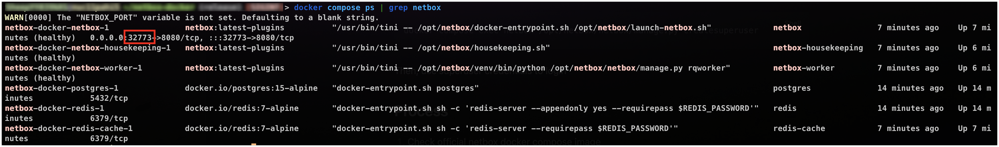

## Method

### Installation and Setup

```bash
git clone -b release https://github.com/netbox-community/netbox-docker.git
```

```bash
cd netbox-docker
```

The `netbox-docker` directory contains

1. files required for the container to spin up
2. Configuration files

The directory already contains a `docker-compose.yml` file. Custom `docker compose` configurations can be entered in `docker-compose.override.yml`, which will be read after `docker-compose.yml` file, and overwrite any overlapping configurations.

:::warning

The default cloned repository is not ready for production. Needs to change environment variables before exposing the service.

:::

```yaml
# docker-compose.override.yml
version: '3.4'
services:
  netbox:
    image: netbox:latest-plugins
    ports:
      - $NETBOX_PORT:8080
    build:
      context: .
      dockerfile: Dockerfile-Plugins
    env_file: .env
  netbox-worker:
    image: netbox:latest-plugins
    env_file: .env
    build:
      context: .
      dockerfile: Dockerfile-Plugins
  netbox-housekeeping:
    image: netbox:latest-plugins
    env_file: .env
    build:
      context: .
      dockerfile: Dockerfile-Plugins
  postgres:
    env_file: .env
    volumes:
      - ./db:/var/lib/postgresql/data
    environment:
      POSTGRES_DB: $DB_NAME
      POSTGRES_PASSWORD: $DB_PASSWORD
      POSTGRES_USER: $DB_USER
  redis:
    env_file: .env
    volumes:
      - ./redis:/data
  redis-cache:
    environment:
      REDIS_PASSWORD: $REDIS_CACHE_PASSWORD
    env_file: .env
#
volumes:
  netbox-media-files:
    driver: local
    driver_opts:
      o: bind
      type: none
      device: ./media
  netbox-redis-cache-data:
    driver: local
  netbox-reports-files:
    driver: local
    driver_opts:
      o: bind
      type: none
      device: ./reports
  netbox-scripts-files:
    driver: local
    driver_opts:
      o: bind
      type: none
      device: ./scripts
```

```bash
# .env
CORS_ORIGIN_ALLOW_ALL=True

DB_HOST=postgres
DB_NAME=netbox
DB_PASSWORD=<RANDOM_PASSWORD>
DB_USER=netbox

EMAIL_FROM=netbox@bar.com
EMAIL_PASSWORD=
EMAIL_PORT=25
EMAIL_SERVER=localhost
EMAIL_SSL_CERTFILE=
EMAIL_SSL_KEYFILE=
EMAIL_TIMEOUT=5
EMAIL_USERNAME=netbox
# EMAIL_USE_SSL and EMAIL_USE_TLS are mutually exclusive, i.e. they can't both be `true`!
EMAIL_USE_SSL=false
EMAIL_USE_TLS=false

GRAPHQL_ENABLED=true
HOUSEKEEPING_INTERVAL=86400
MEDIA_ROOT=/opt/netbox/netbox/media
METRICS_ENABLED=false

REDIS_CACHE_DATABASE=1
REDIS_CACHE_HOST=redis-cache
REDIS_CACHE_INSECURE_SKIP_TLS_VERIFY=false
REDIS_CACHE_PASSWORD=<RANDOM_PASSWORD>
REDIS_CACHE_SSL=false

REDIS_DATABASE=0
REDIS_HOST=redis
REDIS_INSECURE_SKIP_TLS_VERIFY=false
REDIS_PASSWORD=<RANDOM_PASSWORD>
REDIS_SSL=false

RELEASE_CHECK_URL=https://api.github.com/repos/netbox-community/netbox/releases
SECRET_KEY='<GENERATED_SECRET_KEY>'
SKIP_SUPERUSER=true
WEBHOOKS_ENABLED=true
```

1. The local volumes are mapped to local directories for persistent data storage.
2. Environment variables are moved to a centralized file for easy management
3. `<GENERATED_SECRET_KEY>` is generated using `docker compose run netbox python3 /opt/netbox/netbox/generate_secret_key.py` in `netbox-docker` directory
1. [Configuration · netbox-community/netbox-docker Wiki · GitHub](https://github.com/netbox-community/netbox-docker/wiki/Configuration)



Go to `IP:32773` to check

### Create Superuser

After the container is up, need to create superuser

```bash
docker compose exec netbox /opt/netbox/netbox/manage.py createsuperuser
```

Then, use superuser credentials to login

### Installing Plugins

Guide: [Using Netbox Plugins · netbox-community/netbox-docker Wiki · GitHub](https://github.com/netbox-community/netbox-docker/wiki/Using-Netbox-Plugins)
Resources:

- [Awesome NetBox | awesome-netbox](https://osism.github.io/awesome-netbox/)

#### Setup Configuration

```bash
touch plugin_requirements.txt Dockerfile-Plugins
```

`plugin_requirements.txt`

```
netbox-secrets
```

`Dockerfile-Plugins`

```dockerfile
FROM netboxcommunity/netbox:latest

COPY ./plugin_requirements.txt /opt/netbox/
RUN /opt/netbox/venv/bin/pip install  --no-warn-script-location -r /opt/netbox/plugin_requirements.txt

# These lines are only required if your plugin has its own static files.
COPY configuration/configuration.py /etc/netbox/config/configuration.py
COPY configuration/plugins.py /etc/netbox/config/plugins.py
# NOTE: This SECRET_KEY is only used during the installation. There's no need to change it.
RUN SECRET_KEY="dummydummydummydummydummydummydummydummydummydummy" /opt/netbox/venv/bin/python /opt/netbox/netbox/manage.py collectstatic --no-input
```

#### Enable plugins in the configuration

`configuration/plugins.py`

```python
PLUGINS = ["netbox_secrets"]

# PLUGINS_CONFIG = {
#   "netbox_secretstore": {
#     ADD YOUR SETTINGS HERE
#   }
# }
```

#### Build plugins after updating configuration

```bash
docker compose build --no-cache
docker compose up -d
```

---

## Process

1. Check official netbox docker compose image
1. [GitHub - netbox-community/netbox-docker: 🐳 Docker Image of NetBox](https://github.com/netbox-community/netbox-docker)
2. Quite complicated, looking to see if there is an easier way
1. [GitHub - linuxserver/docker-netbox](https://github.com/linuxserver/docker-netbox)
1. hmmm....
3. Decided to try official way
1. ![[Pasted image 20231206131933.png]]
2. Wait...
3. Access on webpage
4. Create admin user
1. `docker compose exec netbox /opt/netbox/netbox/manage.py createsuperuser`
5. Setup
1. [HomeLab Stage LIV: Datacenter Documentation - VCDX #181 Marc Huppert](https://vcdx181.com/homelab-stage-liv-datacenter-documentation/)

---

## Random Information

### The thing about Device Types

There is a library of device types on [GitHub](https://github.com/netbox-community/devicetype-library), go there and check if you can find the device model you want and import it into Netbox.

#### Automated Device Type Import

[GitHub - netbox-community/Device-Type-Library-Import: This library is intended to assist with importing device and module types into NetBox from the NetBox Community DeviceType-Library](https://github.com/netbox-community/Device-Type-Library-Import)

I added ghcr.io/minitriga/netbox-device-type-library-import in my `docker-compose.override.yml` file, and it automatically imports the device types from the vendors I specified.

```yaml
netbox-device-type-library-import:
 image: ghcr.io/minitriga/netbox-device-type-library-import
 environment:
  NETBOX_URL: http://netbox:8080
  NETBOX_TOKEN: <NETBOX_TOKEN>
  # VENDORS:
```

### Possibility of Snipe-it integration

netbox is great, but is there a better method to manage my inventory assets?

### How to use netbox-ping-scan

[GitHub - henrionlo/netbox-ping-scan: Netbox plugin to scan your network and reflect it inside Netbox IPAM](https://github.com/henrionlo/netbox-ping-scan)

#### Clone repo

```bash
cd netbox-docker
git clone https://github.com/henrionlo/netbox-ping-scan
```

#### Edit the script to match environment

Edit the `netbox-ping-scan.py` file

```python
NETBOX_URL = "http://localhost:<YOUR_NETBOX_PORT>"
NETBOX_TOKEN = "<NETBOX_API_TOKEN>"
```

#### Set IP Range to be scanned

Create two new tags in Netbox (Customization > Tags)

1. `autoscan`
1. set `Allowed Object Types` to `IPAM > IP address`
2. `toscan`
1. set `Allowed Object Types` to `IPAM > prefix`

Add and tag `IPAM > Prefixes`

1. add new prefix `192.168.1.0/24` and add `toscan` tag

Add IP Address to be updated by the script

1. add the IPs in `IPAM > IP Addresses` and add the `autoscan` tag

#### Install dependencies and run script

```bash
python3 -m venv venv
. ./venv/bin/activate # . ./venv/bin/activate.fish
pip install pynetbox requests ipaddress urllib3
python ./netbox-ping-scan/netbox-ping-scan.py
```

### netbox-agent

[GitHub - Solvik/netbox-agent: Netbox agent to run on your infrastructure's servers](https://github.com/Solvik/netbox-agent)

#### Clone Repository

```bash
git clone https://github.com/Solvik/netbox-agent.git
cd netbox-agent
```

#### Edit code to match latest pynetbox API

[pynetbox](https://github.com/digitalocean/pynetbox/)

1. In `./netbox_agent/server.py` change all `device_role=` to `role=`

:::danger[Reason for the change]

Error during script execution

```log
DEBUG:urllib3.connectionpool:http://localhost:32773 "POST /api/dcim/devices/ HTTP/1.1" 400 36
Traceback (most recent call last):
File "/usr/local/bin/netbox_agent", line 8, in \<module>
 sys.exit(main())
   File "/usr/local/lib/python3.10/dist-packages/netbox_agent/cli.py", line 50, in main
     return run(config)
   File "/usr/local/lib/python3.10/dist-packages/netbox_agent/cli.py", line 43, in run
     server.netbox_create_or_update(config)
   File "/usr/local/lib/python3.10/dist-packages/netbox_agent/server.py", line 407, in netbox_create_or_update
     server = self._netbox_create_server(datacenter, tenant, rack)
   File "/usr/local/lib/python3.10/dist-packages/netbox_agent/server.py", line 272, in _netbox_create_server
     new_server = nb.dcim.devices.create(
   File "/usr/local/lib/python3.10/dist-packages/pynetbox/core/endpoint.py", line 309, in create
     ).post(args[0] if args else kwargs)
   File "/usr/local/lib/python3.10/dist-packages/pynetbox/core/query.py", line 387, in post
     return self._make_call(verb="post", data=data)
   File "/usr/local/lib/python3.10/dist-packages/pynetbox/core/query.py", line 282, in _make_call
     raise RequestError(req)
 pynetbox.core.query.RequestError: The request failed with code 400 Bad Request: {'role': ['This field is required.']}
```

Checked recent changes in [pynetbox](https://github.com/digitalocean/pynetbox/)  and found that all `device_role=` params are changed to `role=`

:::

#### Install requirements

```bash
python3 -m venv venv
. ./venv/bin/activate
pip3 install -r requirements.txt
```

#### Edit Config File

```bash
sudo vim /etc/qualification
```

`/etc/qualification`:

```
datacenter: <DATACENTER_LOCATION>
```

```bash
sudo vim /etc/netbox_agent.yaml
```

```yaml
# /etc/netbox_agent.yaml
# Netbox configuration
netbox:
  url: 'http://<NETBOX_IP>:<NETBOX_PORT>'
  token: '<NETBOX_API_TOKEN>'
 # uncomment to disable ssl verification
 # ssl_verify: false
 # uncomment to use the system's CA certificates
 # ssl_ca_certs_file: /etc/ssl/certs/ca-certificates.crt

# Network configuration
network:
  # Regex to ignore interfaces
  ignore_interfaces: "(dummy.*|docker.*)"
  # Regex to ignore IP addresses
  ignore_ips: (127\.0\.0\..*)
  # enable auto-cabling by parsing LLDP answers
  lldp: false

#
# You can use these to change the Netbox roles.
# These are the defaults.
#
device:
  #chassis_role: "Server Chassis"
  #blade_role: "Blade"
  server_role: "<SERVER_ROLE>"
# tags: server, blade, ,just a comma,delimited,list
# custom_fields: field1=value1,field2=value2#
#
# Can use this to set the tenant
#
#tenant:
# driver: "file:/tmp/tenant"
# regex: "(.*)"

## Enable virtual machine support
# virtual:
#   # not mandatory, can be guessed
#   enabled: True
#   # see https://netbox.company.com/virtualization/clusters/
#   cluster_name: my_vm_cluster

# Enable datacenter location feature in Netbox
datacenter_location:
 driver: "cmd:cat /etc/qualification | tr [A-Z] [a-z]"
 regex: "datacenter: (?P<datacenter>[A-Za-z0-9]+)"
# driver: 'cmd:lldpctl'
# regex: 'SysName: .*\.([A-Za-z0-9]+)'
#
# driver: "file:/tmp/datacenter"
# regex: "(.*)"

# Enable rack location feature in Netbox
# rack_location:
# driver: 'cmd:lldpctl'
# match SysName: sw-dist-a1.dc42
# regex: 'SysName:[ ]+[A-Za-z]+-[A-Za-z]+-([A-Za-z0-9]+)'
#
# driver: "file:/tmp/datacenter"
# regex: "(.*)"

# Enable local inventory reporting
inventory: true
```

#### Register Device

```bash
python3 -m netbox_agent.cli --register
```

#### Update network

```shell
python3 -m netbox_agent.cli --update-network
```

#### Update Inventory

```bash
python3 -m netbox_agent.cli --update-inventory
```
