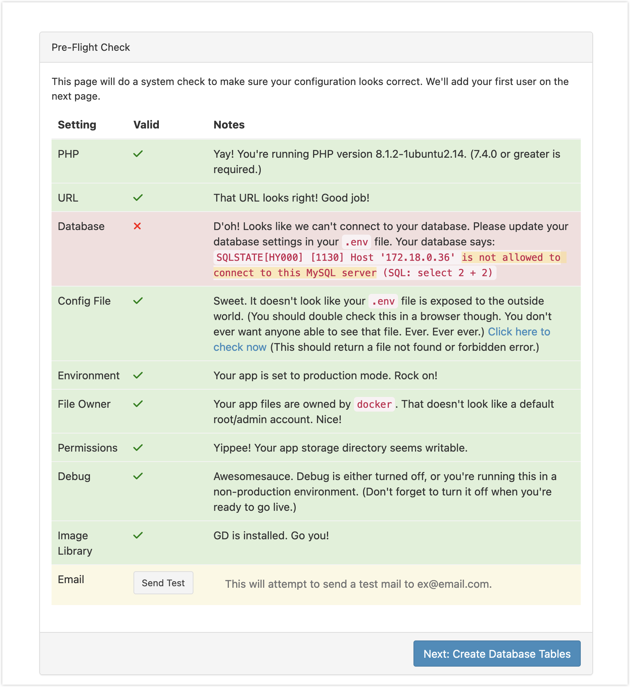
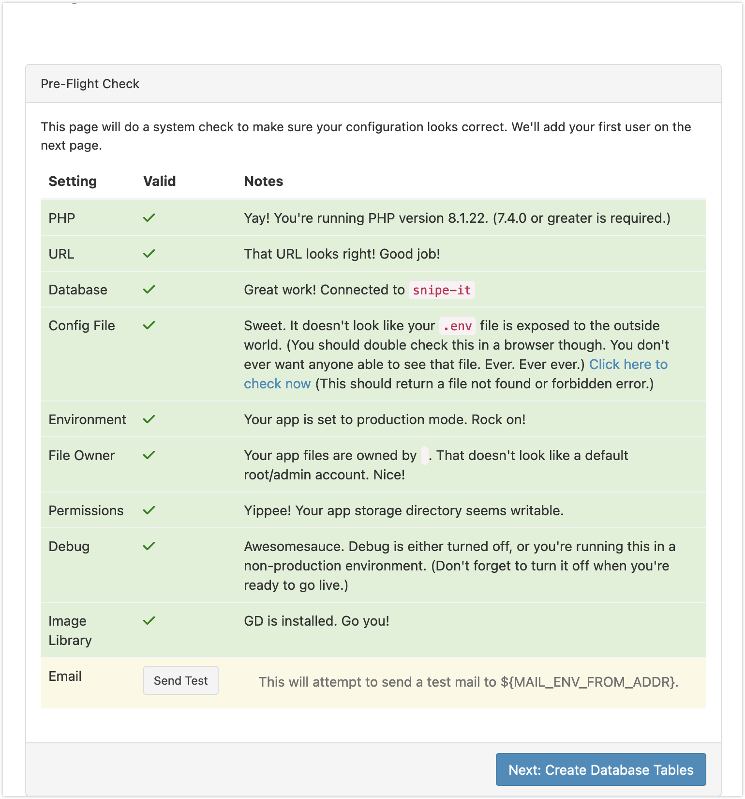

[docker-compose部署资产管理系统Snipe-IT - 厚礼蝎 - 博客园](https://www.cnblogs.com/guangdelw/p/17496598.html)

## 前言 

I have played with this container before, but there was an error when I spin it up. 



I decided to do a fresh re-install.

## Installation

I decided to use the container image from linuxserver because the [official one](https://snipe-it.readme.io/docs/docker) is quite confusing. 

Linuxserver Snipe-it: [snipe-it - LinuxServer.io](https://docs.linuxserver.io/images/docker-snipe-it/#umask-for-running-applications)

Because a database is required, I also spin up an instance of linuxserver mariadb. 
[GitHub - linuxserver/docker-mariadb](https://github.com/linuxserver/docker-mariadb)

```yaml
  snipe-it:
    <<: *common-keys-apps
    image: lscr.io/linuxserver/snipe-it:latest
    container_name: snipe-it
    environment:
      <<: *default-tz-puid-pgid
      APP_URL: https://snipe-it.$DOMAIN
      MYSQL_PORT_3306_TCP_ADDR: snipe-it-db
      MYSQL_PORT_3306_TCP_PORT: 3306
      MYSQL_DATABASE: $SNIPE_IT_DB
      MYSQL_USER: $SNIPE_IT_DB_USER
      MYSQL_PASSWORD: $SNIPE_IT_DB_PASSWORD
    depends_on:
      - snipe-it-db
    volumes:
      - $DOCKERDIR/snipe-it/config:/config
    ports:
      - $SNIPE_IT_PORT:80
    labels:
      traefik.enable: true

  snipe-it-db:
    <<: *common-keys-apps
    image: lscr.io/linuxserver/mariadb:latest
    container_name: snipe-it-db
    environment:
      <<: *default-tz-puid-pgid
      MYSQL_ROOT_PASSWORD: $SNIPE_IT_DB_ROOT_PASSWORD
      MYSQL_DATABASE: $SNIPE_IT_DB #optional
      MYSQL_USER: $SNIPE_IT_DB_USER #optional
      MYSQL_PASSWORD: $SNIPE_IT_DB_PASSWORD #optional
      # - REMOTE_SQL=http://URL1/your.sql,https://URL2/your.sql #optional
    volumes:
      - $DOCKERDIR/snipe-it/db:/config
    # ports:
      # - 3306:3306
```


```sh
# .env
SNIPE_IT_PORT=<SET_PORT_NUMBER>
##############################################################################
####### SNIPE_IT
SNIPE_IT_DB_ROOT_PASSWORD=<SET_DB_ROOT_PASSWORD>
SNIPE_IT_DB=<SET_DB_NAME>
SNIPE_IT_DB_PASSWORD=<SET_DB_PASSWORD>
SNIPE_IT_DB_USER=<SET_DB_USER>
```

:::note

I didn't set the port for db because I don't care what port it spins up on, I can just let docker decide it for me

:::

Folder structure: 
```
snipe-it
\- db
\- config
```


Perfect 
