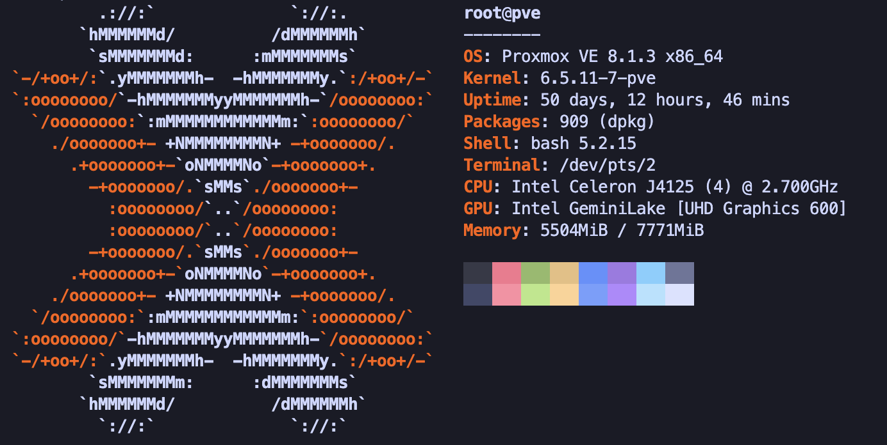

# 🀄 Red Panda



Standalone Proxmox host for **network infrastructure** — soft router, Omada controller, and related edge services. **Not** a member of the zs-lab PVE cluster (`sparrow`, `phoenix`, `duck`, `unicorn`). Treat as mission-critical: minimal changes, no experimental workloads, prefer long uptimes.

## Specs

- OS: Proxmox VE (kernel 6.5.11-7-pve, Debian 12 bookworm)
- CPU: Intel Celeron J4125 (4C/4T) @ 2.7 GHz
- GPU: Intel UHD Graphics 600 (Gemini Lake, `i915`)
- Memory: 8 GiB
- Disk: 128 GB SSD (SanDisk i100)
- Hostname: Red Panda
- IP: `192.168.100.2` (management / LAN bridge)

## Network

| Interface | Chip           | Speed (observed) | Role (per `interfaces`)   |
| --------- | -------------- | ---------------- | ------------------------- |
| `enp1s0`  | Intel I226-V   | —                | Management                |
| `enp2s0`  | Intel I226-V   | 2.5 Gbps         | LAN to switch             |
| `eno1`    | onboard        | 100 Mbps         | WAN 1                     |
| `enp4s0`  | Intel I226-V   | 1 Gbps           | WAN 2                     |

Also: `tailscale0`

Bridges: `vmbr0` (mgmt + LAN), `vmbr0.100`, `vmbr0.15`, `vmbr1` (WAN 1), `vmbr2` (WAN 2)

## VMs / LXCs

### 101 Omada LXC

- Memory: 2048 MiB
- Cores: 2
- Storage: 10 GiB
- Swap: 1024 MiB
- Network: bridge `vmbr0`, static IP `192.168.100.4/24`

### 102 OPNsense

- Memory: 8.0 GiB
- Cores: 4 (1 socket, 4 cores) [x86-64-v2-AES]
- Storage: 40 GiB
- Network:
  - net0: bridge `vmbr0`
  - net1: bridge `vmbr1`
  - net2: bridge `vmbr2`
- Backup: configuration backed up to GitHub

## Network configuration

```bash
# /etc/network/interfaces
# network interface settings; autogenerated
# Please do NOT modify this file directly, unless you know what
# you're doing.
#
# If you want to manage parts of the network configuration manually,
# please utilize the 'source' or 'source-directory' directives to do
# so.
# PVE will preserve these directives, but will NOT read its network
# configuration from sourced files, so do not attempt to move any of
# the PVE managed interfaces into external files!

auto lo
iface lo inet loopback

auto enp1s0
iface enp1s0 inet manual
#Management Port

auto enp2s0
iface enp2s0 inet manual
#LAN out to switch

auto eno1
iface eno1 inet manual
#WAN IP 1 from modem

auto enp4s0
iface enp4s0 inet manual
#WAN IP 2 from modem

auto vmbr0
iface vmbr0 inet static
        address 192.168.100.2/24
        gateway 192.168.100.1
        bridge-ports enp1s0 enp2s0
        bridge-stp off
        bridge-fd 0
#Management Port + LAN

auto vmbr1
iface vmbr1 inet manual
        bridge-ports eno1
        bridge-stp off
        bridge-fd 0
#WAN Bridge for IP 1

auto vmbr2
iface vmbr2 inet manual
        bridge-ports enp4s0
        bridge-stp off
        bridge-fd 0
#WAN Bridge for IP 2

source /etc/network/interfaces.d/*
```

## Operational notes

- Lives on **LAN** (`192.168.100.0/24`); not on the server subnet (`192.168.3.0/24`).
- 8 GiB RAM is fully committed to OPNsense + Omada + PVE — do not schedule extra VMs here.
- Prefer config backups (OPNsense → GitHub) over in-place experimentation.
