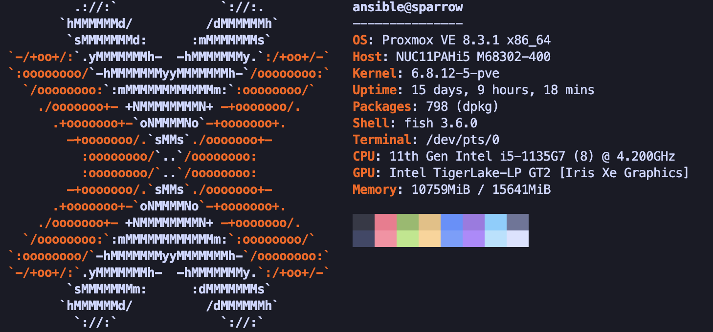

# 🐦 Sparrow

## Specs

- OS: Proxmox VE 8.3.1 (kernel 6.8.12-17-pve, Debian 12 bookworm)
- Host: Intel NUC11PAHi5 (M68302-400)
- CPU: Intel Core i5-1135G7 (4C/8T) @ up to 4.2 GHz
- GPU: Intel Iris Xe Graphics (Tiger Lake-LP, `i915`)
- Memory: 64 GiB
- Disk: 512 GB NVMe (Kingston SNV2S500G)
- Hostname: Sparrow
- IP: `192.168.3.204`

## Network

| Interface | Chip                | Speed (observed) | Notes        |
| --------- | ------------------- | ---------------- | ------------ |
| `enp89s0` | Intel I225-V        | 100 Mbps         | Primary link |
| `wlo1`    | Intel Wi-Fi 6 AX201 | —                | WiFi, down   |

Also: `tailscale0`

Bridges: `vmbr0`, `vmbr0.3` (server VLAN), `vmbr150`, `vmbr30`

## Role

Primary Proxmox node; hosts **whale** (Swarm manager). 500 GB NVMe is tight — prefer **phoenix** or **duck** for new VM disks.
