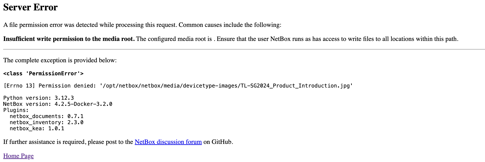

# Netbox Media Permissions

## Issue

I'm trying to add a media file to a device, but I'm getting the following error:



## Solution

### First attempt: update permissions in docker container

```bash
docker exec -it netbox /bin/bash
cd media
chown -R 999 devicetype-images image-attachments
```

```bash
chown: changing ownership of 'devicetype-images/4.jpg': Operation not permitted
chown: changing ownership of 'devicetype-images/2.jpg': Operation not permitted
chown: changing ownership of 'devicetype-images': Operation not permitted
chown: changing ownership of 'image-attachments/module_type_5_61V4SwoA83L.jpg': Operation not permitted
chown: changing ownership of 'image-attachments/device_type_17_1.jpg': Operation not permitted
chown: changing ownership of 'image-attachments/module_type_4_SEAGATE_ST8000VN004_04.png': Operation not permitted
chown: changing ownership of 'image-attachments/device_type_2_Left.jpg': Operation not permitted
chown: changing ownership of 'image-attachments/device_type_2_Front.jpg': Operation not permitted
chown: changing ownership of 'image-attachments/device_type_2_Right_View.jpg': Operation not permitted
chown: changing ownership of 'image-attachments/device_type_2_Back_View.jpg': Operation not permitted
chown: changing ownership of 'image-attachments/module_type_6_s-l1200.webp': Operation not permitted
chown: changing ownership of 'image-attachments/device_type_7_Right_View.jpg': Operation not permitted
chown: changing ownership of 'image-attachments/device_type_7_Left_View.jpg': Operation not permitted
chown: changing ownership of 'image-attachments/device_type_7_Front_View.jpg': Operation not permitted
chown: changing ownership of 'image-attachments/device_type_7_Back_View.jpg': Operation not permitted
```

### Second attempt: update permissions in host directory

Since the media folder is mounted from the host, we can update the permissions in the host directory.

```bash
cd media # Go to the media folder
sudo chown -R 999:999 devicetype-images image-attachments
```

Solved.

