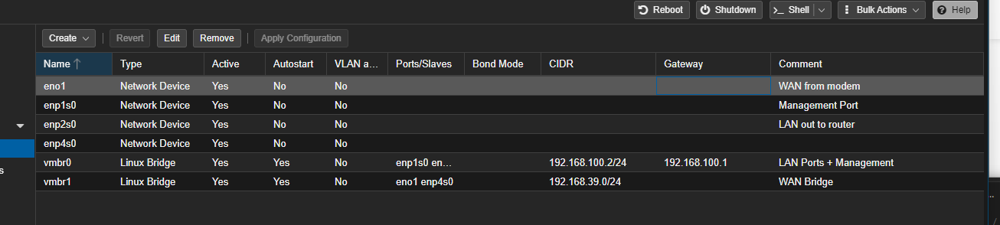

| Port Name          | Notes               |
| ------------------ | ------------------- |
| `enp1s0`           | The management Port |
| `enp2s0`           | LAN to Router       |
| `eno1` is `enp3s0` | 1st WAN from modem  |
| `enp4s0`           | 2nd WAN from modem  |

## Resources

[WAN / LAN Set Up (Before OPNSense Installation) - Bachelor Tech](https://bachelor-tech.com/home-server-router-all-in-one/wan-lan-split-proxmox/)
